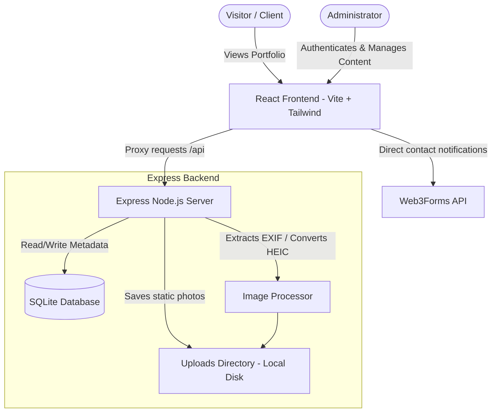

# 📷 Odyssey: Premium Cinematic Travel & Adventure Photography Portfolio

Odyssey is a premium, state-of-the-art photography portfolio and administrative content management system (CMS). Designed for visual storytellers, it combines an immersive, responsive frontend with a secure, highly optimized backend to deliver high-resolution imagery seamlessly.

---

## 🌟 Key Features

### 🌌 Immersive Cinematic Front-End
- **WebGL Interactive Background**: A custom, GPU-accelerated atmospheric smoke wave and floating interactive particle field using **Three.js**. Automatically checks user system accessibility preferences (`prefers-reduced-motion`) and halts animation loops to conserve CPU/GPU cycles.
- **Dynamic Masonry Bento Layout**: A visually striking grid layout for the gallery and highlights section that elegantly stacks landscape, portrait, and square frames without gaps.
- **Cinematic Text Reveal**: Fluid letter-reveal typography animations powered by **Framer Motion** to deliver a sleek visual landing.
- **Responsive Sizing System**: Modern CSS `clamp()` typography and container sizing supporting displays from 320px mobile viewports up to 4K ultra-wide monitors.
- **Image Copy Protection**: Disabled drag-and-drop actions, user selection properties, and context menus (`right-click`) to deter casual saving of original creative works.
- **Smooth Custom Cursor**: Dynamic fluid mouse tracker that adapts to user interactions.

### 🛡️ Secure Admin Panel
- **Session-Based Authentication**: Secure admin login and token verification matching server-side cryptographically salted **PBKDF2** password hashes.
- **Password Complexity Engine**: Validates password requirements strictly (minimum 8 characters, lowercase, uppercase, numerical digit, and special symbol).
- **Comprehensive Settings Console**: Modify personal information, update email configurations, upload profile avatars, edit the visual subtitle sections, or alter passwords.
- **Dynamic Categories (Subsections) Manager**: Create and organize custom photo subsections (e.g., Landscapes, Sunsets, Portraits, Streets) on the fly.
- **Flexible Photo Content Control**: Upload, delete, change display order, toggle featured highlights status, modify location meta tags, and reconfigure grid spans (`sizeClass`) dynamically.

### ⚡ Performance-Engineered Backend
- **Hybrid Storage Pipeline**: Local disk storage keeps heavy DSLR and smartphone images (`10MB - 25MB+`) organized as physical static files in the `/uploads/` directory on the server, keeping SQLite lightweight and fast.
- **Binary Stream Uploader & EXIF Parser**: Reads metadata (focal length, shutter speed, aperture, ISO) automatically from uploaded images. Natively converts high-quality iPhone `.heic` and `.heif` images to `.jpg` format.
- **Database Auto-Migration**: Built-in startup task detects legacy Base64 image blobs stored inside SQLite, extracts them into static physical files on disk, and updates database references dynamically.
- **Security & Rate-Limiting**: Configured with `helmet` for Vite-friendly Content Security Policies (CSP) and `express-rate-limit` to prevent denial-of-service and brute-force attempts on administrative routes.

---

## 🏗️ System Architecture



---

## 📂 Repository File Structure

```
├── .vite/                  # Vite cache directory
├── dist/                   # Production build outputs (compiled static files)
├── imgs/                   # Default static assets / profile images
├── src/                    # Frontend React codebase
│   ├── components/         # Reusable frontend layout components
│   │   ├── AdminPanel.jsx           # Administrative control panel & settings
│   │   ├── CinematicBackground.jsx  # Three.js WebGL smoke & particle canvas
│   │   ├── CinematicTextReveal.jsx  # Framer Motion animated entry text
│   │   ├── CustomCursor.jsx         # Interactive cursor tracking effect
│   │   ├── Hero.jsx                 # Landing introduction section
│   │   ├── LeafBackground.jsx       # SVG floating foliage details
│   │   ├── Lightbox.jsx             # Overlay for high-res photo viewing
│   │   ├── MistyMeshBackground.jsx  # Soft color-mesh background details
│   │   ├── PhotoGrid.jsx            # Bento layout gallery with categorizations
│   │   └── Watermark.jsx            # Custom watermark overlay on protected images
│   ├── utils/
│   │   └── imageProcessor.js        # Client side processing utilities
│   ├── App.jsx             # Main routing, state manager, and synchronization
│   ├── index.css           # Global CSS variables & Tailwind config imports
│   └── main.jsx            # React root mount point
├── uploads/                # Dynamic uploaded static images (local disk storage)
├── vercel.json             # Vercel Serverless routing configurations
├── server.js               # Express application server & API router
├── seed.js                 # Initial SQLite sample data seeder
├── vite.config.js          # Vite server and proxy configuration
└── package.json            # NPM scripts & package dependencies
```

---

## 🛠️ Technology Stack

- **Frontend**: React 18, Tailwind CSS v4, Vite, Framer Motion, Lucide React, Three.js (WebGL).
- **Backend**: Node.js, Express, SQLite, Rate Limiters, Body Parsers, Helmet.
- **Libraries**: ExifReader, heic2any.

---

## ⚙️ Project Setup

### 📦 Prerequisites
Install [Node.js](https://nodejs.org/) (v18+ recommended).

### 🔧 Installation
1. Clone the repository and navigate to the project root:
   ```bash
   git clone https://github.com/udayjpatel2006/UDAYJPATEL.git
   cd UDAYJPATEL
   ```
2. Install all dependencies:
   ```bash
   npm install
   ```

### 🖥️ Running Locally (Development)
Launch the Express backend database API (listening on port 5000) and the Vite development frontend client (listening on port 3000) concurrently:
```bash
npm run dev
```
Open **`http://localhost:3000/`** in your browser.

### 🔐 Admin Authentication
- Access the Admin Panel at: **`http://localhost:3000/admin`**
- Default testing Passcode: **`Uday@12345#`**

### 🏗️ Production Build & Static Serving
Compile the frontend asset bundles for deployment:
```bash
npm run build
```
Start the production server:
```bash
npm start
```

---

## ☁️ Deployment on Vercel

Vercel is a serverless hosting provider that runs on an ephemeral (temporary) file system. This project is fully configured to use **Cloudinary** for runtime image uploads:
- **Cloud Image Hosting**: All new image uploads are sent straight to Cloudinary and served globally via secure HTTPS URLs, ensuring uploads are fully persistent.
- **Persistent Database**: Because the SQLite database is read-only on Vercel, any changes to photo list layouts, position orders, profile titles, or custom categories should be synchronized using the Git workflow:
  1. Run the project locally on your machine (`npm.cmd run dev`).
  2. Upload new photos (they will be sent to Cloudinary) and arrange grid positions through your local admin panel (`http://localhost:3000/admin`).
  3. Commit and push the updated `database.sqlite` file to GitHub.
  4. Vercel will automatically redeploy the site, showing your new photos online immediately!

### ⚙️ Vercel Import Steps
1. Log in to [Vercel](https://vercel.com/) and click **Add New** -> **Project**.
2. Select your repository: `UDAYJPATEL`.
3. Vercel will automatically parse the `vercel.json` file.
4. Set the following **Environment Variables** in the Vercel project settings:
   - `CLOUDINARY_CLOUD_NAME`: (Your Cloudinary cloud name)
   - `CLOUDINARY_API_KEY`: `689444139574263`
   - `CLOUDINARY_API_SECRET`: `YeNGtw1j9Xr7-Lj3TiN_hf6ICfk`
5. Click **Deploy**. Your site will be online in about 1-2 minutes!